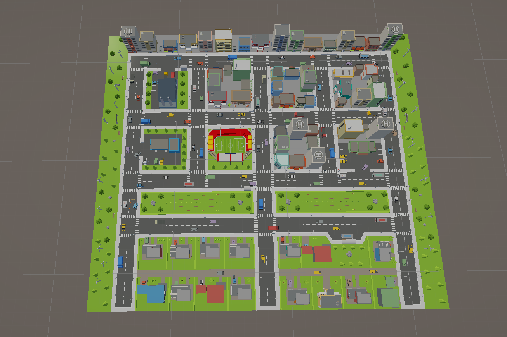
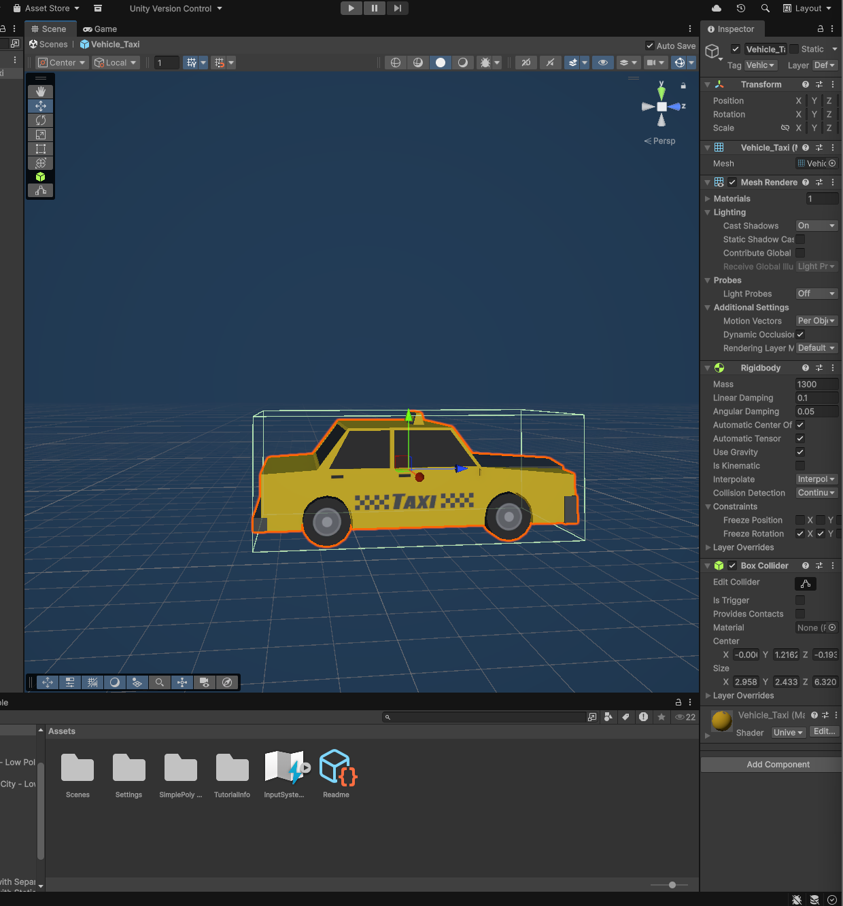

# 🚖 Vehículo Autónomo con IA Híbrida (ML-Agents)

Este proyecto implementa un sistema de conducción autónoma en Unity que combina **Aprendizaje por Refuerzo (Reinforcement Learning)** para el control físico y evasión de obstáculos, con algoritmos de Búsqueda para la navegación global en una ciudad simulada.

---

## 📸 Demo y Visualización

### 🎥 Funcionamiento en Tiempo Real
> *Aquí puedes ver al agente navegando de forma autónoma, respetando carriles y esquivando obstáculos dinámicos.*


### 🏙️ Entorno Urbano (La Ciudad)


### 🏎️ El Vehículo
> *Vista detallada del agente (Taxi) y sus sensores de percepción (Raycasts).*




---

## 🧠 Arquitectura del Sistema

El proyecto utiliza una **Arquitectura Híbrida** que divide la conducción en dos niveles de inteligencia:

### 1. Nivel Estratégico (El "GPS") 🗺️
Utiliza el algoritmo **A* (A-Star)** sobre un grafo de nodos (`WaypointInfo`) pre-calculado en la ciudad.
* **Función:** Calcula la ruta más corta entre el punto A y el punto B.
* **Lógica:** Inyecta secuencialmente los nodos de destino al sistema de navegación del coche.
* **Intersecciones:** Maneja cruces complejos utilizando nodos de Entrada/Salida para validar giros legales.

### 2. Nivel Táctico (El "Piloto") 🤖
Una Red Neuronal entrenada con **PPO (Proximal Policy Optimization)** mediante ML-Agents.
* **Función:** Controla el volante, acelerador y freno.
* **Percepción:** Utiliza `RayPerceptionSensor3D` (Lidar simulado) y observaciones vectoriales.
* **Habilidades:** Detección de carriles, evasión de obstáculos estáticos/dinámicos y recuperación ante bloqueos.

---

## 🛠️ Tecnologías Utilizadas

* **Motor:** Unity 2022+
* **IA Framework:** Unity ML-Agents (Release 20+)
* **Entrenamiento:** Python / PyTorch
* **Lenguaje:** C#
* **Matemáticas:** Álgebra Vectorial (Dot Product para carriles), Teoría de Grafos.

---

## 🚀 Instalación y Uso

1.  **Clonar el Repositorio:**
    ```bash
    git clone [https://github.com/TuUsuario/TuProyecto.git](https://github.com/TuUsuario/TuProyecto.git)
    ```
2.  **Abrir en Unity:**
    * Asegúrate de tener instalado el paquete **ML-Agents** desde el Package Manager.
3.  **Configuración de Escena:**
    * Abre la escena `CityScene`.
    * Selecciona el objeto `SISTEMA_GPS`.
    * Asigna un **Punto Inicio** y un **Punto Destino** (arrastrando los nodos de la escena).
4.  **Ejecutar:**
    * Dale al botón **Play**.
    * Presiona la tecla **ESPACIO** para calcular la ruta e iniciar el agente.

---

## 📊 Metodología de Entrenamiento

El agente fue entrenado utilizando un sistema de recompensas (`Reward Shaping`) iterativo:
* **+ Recompensa:** Acercarse al objetivo, mantener velocidad (>15 km/h), alineación con la ruta.
* **- Castigo:** Colisión con muros/obstáculos, invasión de carril contrario (detectado vía Producto Punto), inactividad.

---

## 📝 Créditos

Desarrollado por **[Tu Nombre]**.
Proyecto de investigación sobre Navegación Autónoma y Sistemas Inteligentes.
